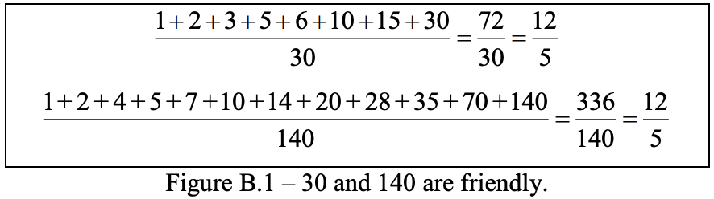
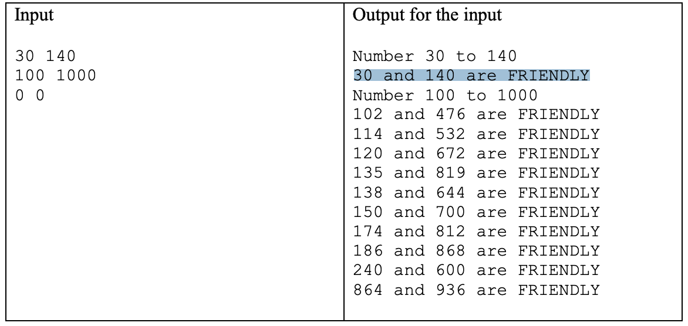

# Compiling e executing
`gcc main.c –o main -fopenmp=libomp `

`./main`

## On Ubuntu
` gcc -o main main.c -fopenmp`

`./main`

# Defining thread number
export OMP_NUM_THREADS=numeroThreads

# Mutually Friendly Numbers
Two numbers are mutually friendly if the ratio of the sum of all divisors of the number
and the number itself is equal to the corresponding ratio of the other number. This ratio is known as the abundancy of a number. For example, 30 and 140 are friendly, since the abundancy of these two numbers is equal. Figure B.1 show this example.

This problem consists in finding all pairs of natural numbers that are mutually friendly
within the range of positive integers provided to the program at the start of the
execution.
Write a parallel program to compute mutually friendly numbers.

### Input
The input contains several test cases. Each line contains two integers (1 ≤ S, E < 2
20)
that correspond to the range where the mutually friendly numbers will be searched. The
test case ends when S=0 and E=0.
The input must be read from the standard input.

#### Output
The output contains a message for each mutually friendly numbers found, for each test
case.
The output must be written to the standard output.

### Example

